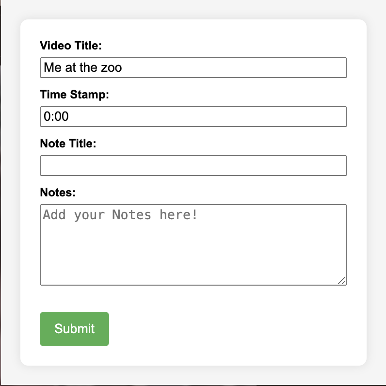

# YT-Notes-Extension

## Description
Chrome extension built to effortlessly capture notes from YouTube videos, allowing users to save them on-the-go, precisely tagged to particular timestamps.

----

## Feature 

1. Timestamped Notes: Take your video-watching journey to the next level by incorporating timestamped notes for capturing precise moments in YouTube videos.

2. Notion Integration: Seamlessly access all your notes stored in a Notion database.

---

## Installation

**To Setup Backend**

1. Clone the project to your local system using: `git clone https://github.com/muskansindhu/YT-Notes-Extension`

2. Setup environment variables

3. Run `python app.py`

**To Setup Chrome Extension in Browser**

1. Open Chrome on your machine and navigate to: `chrome://extensions/`

2. Ensure the "Developer mode" checkbox in the top-right corner is checked.

3. Click on Load Unpacked Extension Button, navigate to the `extension` folder in your cloned repository and select it.

--- 
## Sample

